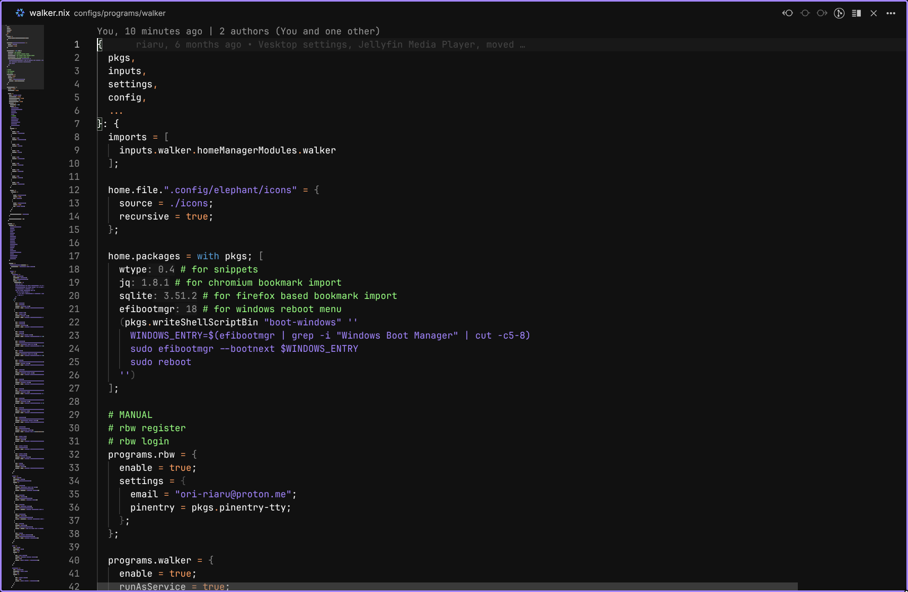
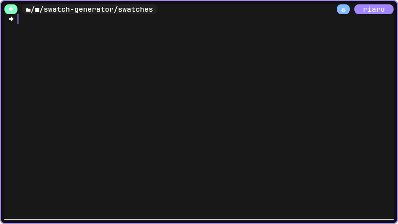

# My NixOS Configuration

My personal Nixos configurations. They are not intended to be used by others however feel free to take parts for your own configuration. Most application have been styled to match my color scheme [Neutral Dark](https://github.com/Ori-Riaru/neutral-dark).

## Structure

- [`flake.nix`](./flake.nix): Entrypoint for System and Home Manager configurations
- [`systems`](./systems/) System configuration usable with `nh os switch`
  - [`share`](./systems/share/): Configurations shared across multiple system
    - [`global`](./systems/share/global/): Global configurations shared across all systems
    - [`features`](./systems/share/features/): Features shared across all systems
  - [`lain`](./systems/lain/): Desktop PC Configuration
  - [`shizuku`](./systems/shizuku/): Laptop Configuration
  - [`fujin`](./systems/fujin/): Server Configuration
    - [`services`](./systems/fujin/services/): Services hosted on this machine
- [`users/riaru`](./users/riaru/): home-manager configuration usable with `nh home switch`
  - [`global`](./users/riaru/global/): home-manager configurations shared across all machines
  - [`programs`](./users/riaru/programs/): Programs installed and configured with home-manager
- [`templates`](./templates/): Templates for setting up new projects
- [`packages`](./packages/): Packages used by the configurations
- [`overlays`](./overlays/): Patches and version overrides for packages

## Featured Configurations

- KDE / (karousel, krohnkite) / touchegg

TODO: add demo

- Firefox

TODO: add demo

- VSCodium

- Kitty / Fish / Starship / Zoxide

- Discord

TODO: add demo

- Spotify

TODO: add demo

- Obsidian

TODO: add demo

- Selfhosted Nextcloud

TODO: add demo
