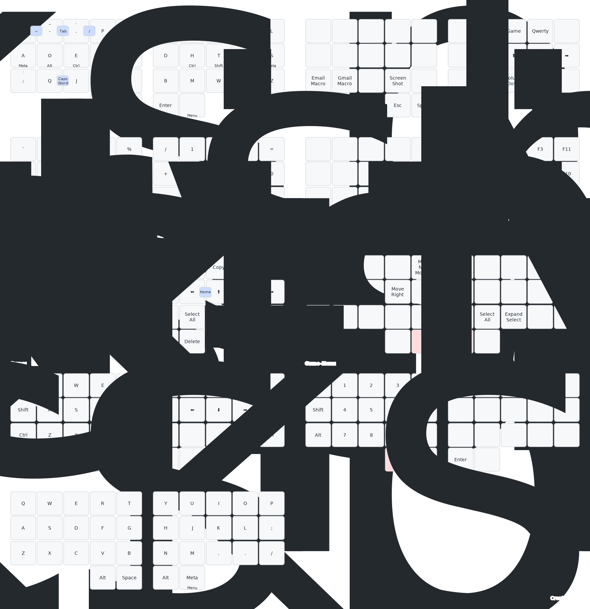
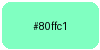

# My NixOS Configuration

My personal Nixos configurations. They are not intended to be used by others however feel free to take parts or ideas for your own configuration. Most application have been styled to match my color scheme Neutral Dark

## Structure

- [`flake.nix`](./flake.nix): Global Settings and entrypoint for the System and Home Manager configurations
- [`configs/`](./configs/): Reusable configurations

  - [`groups/`](./configs/groups/): Groups of programs or services which are commonly imported together
  - [`programs/`](./configs/programs/): Programs and their configurations which can be imported in a system configuration.nix or a users home.nix
  - [`services/`](./configs/services/): Services and their configurations which can be imported in system configuration.nix
  - [`system/`](./configs/system/): Nix and system configurations not specific to a program or service

- [`systems/`](./systems/): System configuration (built with `nh os switch`)

  - [`lain/`](./systems/lain/): System configurations imported for my desktop
  - [`slate/`](./systems/slate/): System configuration imported for my laptop
  - [`kumo/`](./systems/kumo/): System configurations imported for my server

- [`users/`](./users/): Home Manager configurations for each user (built with `nh home switch`)

  - [`riaru/`](./users/riaru/)
    - [`lain/`](./users/riaru/lain)- Home Manager configurations imported to my desktop
    - [`slate/`](./users/riaru/slate)` - Home Manager configurations imported to my laptop
    - [`kumo/`](./users/riaru/kumo) - Home Manager configuration imported to my desktop

- [`starters/`](./starters/): Project starting templates including flake and direnv
- [`packages/`](./packages/): Self package software not available in nix packages
- [`overlays/`](./overlays/): Patches and version overrides for packages
- [`secrets/`](./secrets/): Encrypted credentials, passwords, keys, etc

## Featured Configurations (TODO: outdated update)

- [Niri](./configs/programs/niri/niri.nix) / [Waybar](./configs/programs/waybar/waybar.nix) / [Walker](./configs/programs/walker.nix)

- [Vivaldi](./configs/programs/vivaldi.nix)

- [VSCodium](./configs/programs/vscodium/)

- [Ghostty](./configs/programs/ghostty.nix) / [Fish](./configs/programs/fish.nix) /  [Starship](./configs/programs/starship.nix) / [Zoxide](./configs/programs/zoxide.nix) / [etc](./configs/groups/cli-base.nix)

- [Discord](./configs/programs/discord.nix)

TODO: add demo

- [Spotify](./configs/programs/spotify/spotify.nix)

- [Obsidian](./configs/programs/obsidian.nix)

## Self-hosted Services

- [Mastodon](./configs/services/mastodon/mastodon.nix)
  

- [NextCloud](./configs/services/nextcloud.nix)

- [NFS shares](./configs/services/nfs.nix)

- [Blocky](./configs/services/blocky.nix)

- [Inadyn](./configs/services/inadyn.nix)

### Keyboard Layout & Shortcuts

[Kanata](./configs/programs/kanata.nix)

## Theming

Many application and websites have been themed to match my custom color scheme

| Fonts     |                                                    | \|\| | Spacing  |     |                            |
| --------- | -------------------------------------------------- | ---- | -------- | --- | -------------------------- |
| UI        | [Inter](https://fonts.google.com/specimen/Inter)   | \|\| | `gap`    | 5px | Gap Between Major Sections |
| Monospace | [JetBrainMono](https://www.jetbrains.com/lp/mono/) | \|\| | `radius` | 8px | Radius of Cards            |

### Color Palette

| Color              | Hex                                                                                                      | Swatch                                                       | Usage                                                             |
| ------------------ | -------------------------------------------------------------------------------------------------------- | ------------------------------------------------------------ | ----------------------------------------------------------------- |
| Text               |
| `Text`             | 
#ffffff
   |                          | Basic text, Headers                                               |
| `Subtext`          | 
#aaaaaa
 |                    | Subtext, Placeholder, Comments                                    |
| `Hidden`           | 
#606060
 |                      | Disabled, Hidden                                                  |
| Backgrounds        |
| `base`             | 
#000000
   |                          | Window backgrounds                                                |
| `section`          | 
#111111
   |                    | Major Section, Content Only Window                                |
| `card`             | 
#181818
   |                            | Card, Input, highlighted button                               |
| `overlay`          | 
#222222
   |                    | Search Overlay,                                                   |
| Customizations     |
| `accent`           | 
#a386ff
   |                      | Customizable Primary Accent                                       |
| `accent-secondary` | 
#83bbff
   |  | Customizable Secondary Accent                                    |
| `accent-tertiary`  | 
#fefb77
   |    | Customizable Tertiary Accent                                     |
| Colors             |
| `Red`              | 
#fe5970
   |                            | Error, Remove, Close, Delete, Tags (HTML/XML), Annotations        |
| `Orange`           | 
#ffa062
   |                      | Warning, Numbers                                                  |
| `Yellow`           | 
#fefb77
   |                      | Info, Help                                                        |
| `Green`            | 
#99ff82
   |                        | Strings                                                           |
| `Teal`             | 
#80ffc1
   |                          | Success, New, Add,                                                |
| `Cyan`             | 
#7ef8fe
   |                          | Attributes, Properties (HTML/CSS/JSX)                             |
| `Blue`             | 
#83bbff
   |                          | Neutral, Function Names, Declarations                             |
| `Purple`           | 
#a386ff
   |                      | Modified, Change, Edit, Keywords, Reserved Words, Important Terms |
| `Pink`             | 
#fe99fe
   |                          | Operators (+, -, \*, etc.)                                        |
| `White`            | 
#ffffff
   |                        |                                                                   |
| `Black`            | 
#000000
   |                        |                                                                   |
