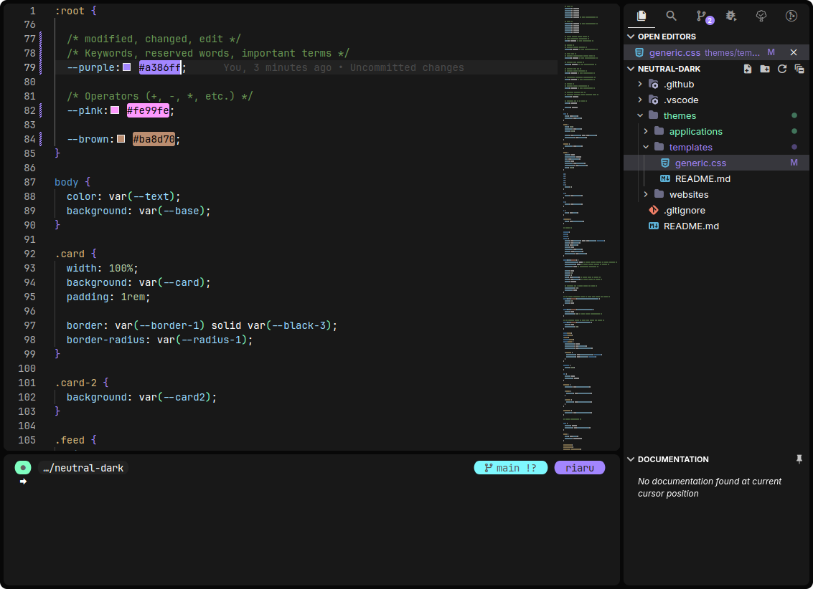

# My NixOS Configuration

My personal Nixos configurations. They are not intended to be used by others however feel free to take parts for your own configuration. Most application have been styled to match my color scheme [Neutral Dark](https://github.com/Ori-Riaru/neutral-dark).

## Structure

- [`flake.nix`](./flake.nix): Entrypoint for the OS and Home Manager configurations + Global Settings
- [`modules/`](./modules/): Reusable configurations
  - [`programs/`](./modules/programs/): Programs and their configuration can be imported user config.
  - [`services/`](./modules/services/): Services and their configuration which can be hosted on any system.
- [`systems/`](./systems/): System configuration (built with `nh os switch`)

  - [`_share/`](./systems/_share/): Configurations shared across multiple system
    - [`global/`](./systems/_share/global/): Global configurations shared across all systems
  - [`lain`](./systems/lain/): Desktop PC Configuration
  - [`shizuku`](./systems/shizuku/): Laptop Configuration
  - [`fujin`](./systems/fujin/): Server Configuration

- [`users/`](./users/): Home Manager configurations (built with `nh home switch`)

  - [`_share/`](./users/_share/): Configuration shareable across multiple users
    - [`global/`](./users/_share/global/): Universal home-manager settings
  - [`riaru/`](./users/riaru/)
    - [`shizuku.nix`](./users/riaru/shizuku.nix)` - Laptop environment for this user
    - [`lain.nix`](./users/riaru/lain.nix)- Desktop environment this user
    - [`fujin.nix`](./users/riaru/fujin.nix) - Server environment this user

- [`starters`](./starters/): Project Starter templates
- [`packages`](./packages/): Self package software not available in nix packages
- [`overlays`](./overlays/): Patches and version overrides for packages
- [`secrets`](./secrets/): Credentials, Passwords, Keys, etc

## Featured Configurations

- [KDE](./modules/programs/kde/) / (karousel, krohnkite) / [touchegg](./modules/programs/touchegg.nix)

- [Firefox](./modules/programs/firefox/)

TODO: add demo

- [VSCodium](./modules/programs/vscodium/)

- [Kitty](./modules/programs/kitty.nix) / [Fish](./modules/programs/fish.nix) / [Starship](./modules/programs/starship.nix) / [Zoxide](./modules/programs/zoxide.nix)

- [Discord](./modules/programs/discord.nix)

TODO: add demo

- [Spotify](./modules/programs/spotify/)

- [Obsidian](./modules/programs/obsidian.nix)

- Selfhosted Services ([Mastodon](./modules/services/mastodon/), NextCloud)

